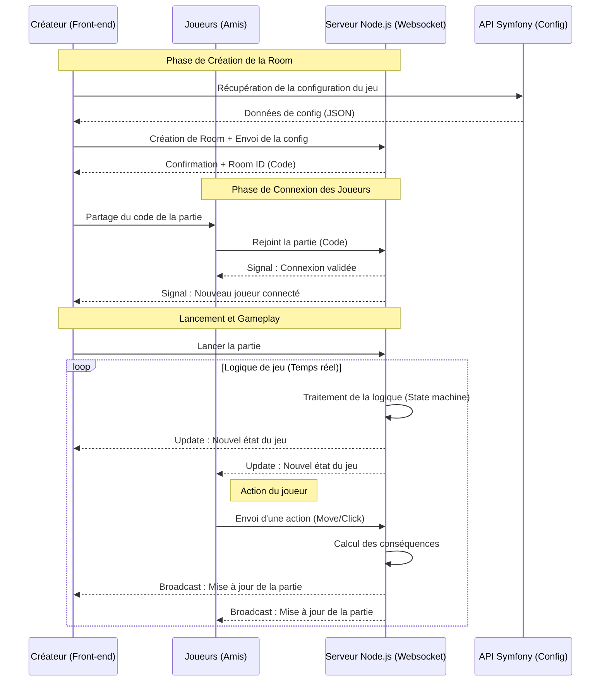

 
# Concept
il y a deux applications : 
- CARD Studio qui permet de créer des jeux de cartes personnalisés, en modifiant n’importe quel élément du jeu et/ou paramètre de la logique.
- Quant à CARD Games, il permet d’accueillir les joueurs ; ils arrivent sur une interface leur permettant de se connecter avec un code et ils rejoignent un menu leur demandant leur pseudo. Ils peuvent sinon choisir de créer une partie parmi plusieurs jeux publics proposés. Dans le cas où un utilisateur de CARD Studio a créé un jeu complet en privé, il obtiendra un code unique. Sur CARD Games, les joueurs pourront alors créer une partie à partir d’un code d’un jeu et non d’un jeu public.

# L'application
Cette application est un serveur de jeux de cartes multijoueur utilisant WebSocket pour permettre une communication en temps réel entre les joueurs. Elle gère la création et la gestion de parties, l’administration des joueurs et des salles, ainsi que la logique des différents jeux de cartes. Le serveur prend en charge l’envoi et la réception d’événements de jeu, la gestion des actions des joueurs, et l’enregistrement des logs pour le suivi des parties. L’architecture est modulaire, facilitant l’ajout de nouveaux jeux ou fonctionnalités. L’application est conçue pour être extensible et facilement testable grâce à une suite de tests automatisés. 

# Stack technique 
- Node.js : plateforme d’exécution JavaScript côté serveur.
- WebSocket : protocole de communication en temps réel pour la gestion des parties multijoueurs.
- JavaScript : langage principal utilisé pour le développement du serveur et des modules.
- Structure modulaire : organisation en modules pour la gestion des actions, joueurs, salles, logs, et logique de jeu.
- Tests automatisés : utilisation de frameworks de test (Jest) pour garantir la fiabilité du code.
- Fichiers de configuration et scripts : Makefile pour automatiser les tâches (tests, lancement du serveur, etc.).

# Architecture de l'application

| Dossier/Fichier | Rôle |
|-----------------|------|
| **core/** | Moteur du jeu, gestion des actions, conditions, événements, erreurs |
| **core/engine/** | Logique d'exécution des actions et événements du jeu |
| **core/error/** | Gestion des erreurs personnalisées |
| **core/game-engine/logger/** | Système de logs et journalisation des événements |
| **core/services/** | Gestion des entités principales (actions, joueurs, parties, salles, messagerie) |
| **core/services/helper/** | Helpers pour la gestion des identifiants, tableaux, types |
| **parser/** | Analyse et gestion des types, expressions et fonctions du jeu |
| **sockets/** | Gestion des WebSockets pour les jeux, joueurs et salles |
| **utilities/** | Fonctions utilitaires diverses |
| **logs/** | Dossiers de logs pour les événements et fonctions |
| **__tests__/** | Tests unitaires et fonctionnels par module |
| **server.js** | Point d'entrée du serveur Node.js |
| **package.json** | Dépendances et scripts npm |
| **Makefile** | Automatisation des tâches (tests, reset, etc.) |

# Création d'un jeu
 

