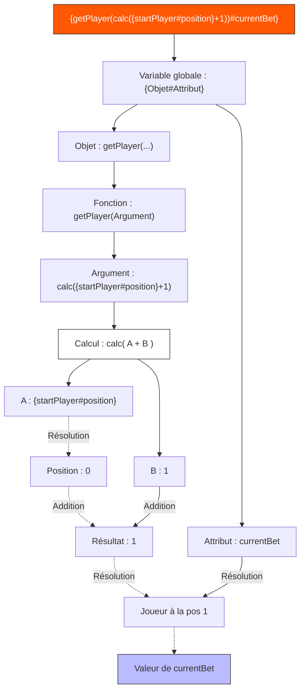

```mermaid
flowchart TB
    Root["{getPlayer(calc({startPlayer#position}+1))#currentBet}"] --> Var["Variable globale : {Objet#Attribut}"]
    Var --> Obj["Objet : getPlayer(...)"] & Attr["Attribut : currentBet"]
    Obj --> Func["Fonction : getPlayer(Argument)"]
    Func --> Arg["Argument : calc({startPlayer#position}+1)"]
    Arg --> Calc["Calcul : calc( A + B )"]
    Calc --> ValA["A : {startPlayer#position}"] & ValB["B : 1"]
    ValA -. Résolution .-> ResA["Position : 0"]
    ResA -. Addition .-> ResCalc["Résultat : 1"]
    ResCalc -. Résolution .-> ResFunc["Joueur à la pos 1"]
    ResFunc -. </br> .-> ResFinal["Valeur de currentBet"]
    ValB -- Addition --> ResCalc
    Attr -- Résolution --> ResFunc

    style Root fill:#ff5804,stroke:#333,color:#fff
    style Calc fill:#fff,stroke:#333
    style ResFinal fill:#bbf,stroke:#333
 
```